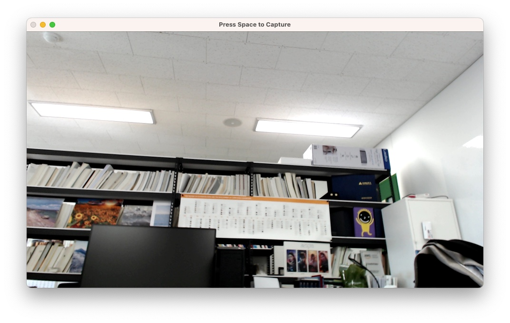

# Take Photo Python

```bash
conda create -n cam python=3.11
conda activate cam

pip install -r requirements.txt

python cam.py
```



If you wanna select the cam number, modify the following number. (0 -> 1, 2, ...)

```
cap = cv2.VideoCapture(0)
```
